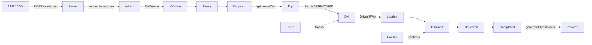
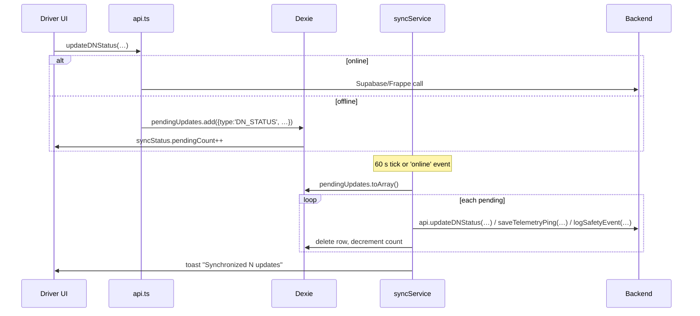
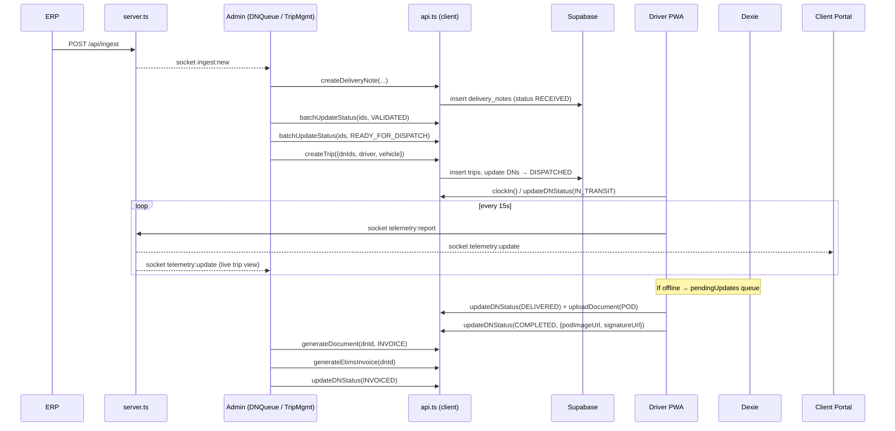

# Shipstack — Delivery Note Lifecycle (Code-Traced Walkthrough)

> A deep, code-linked walk through how a **Delivery Note (DN)** moves from intake to invoicing across the Admin, Dispatch, Driver, Facility, and Client portals. Every transition links back to a specific file and line.

---

## 0. Big Picture

- A **`DeliveryNote`** (`types.ts:230`) is the unit of work. Multiple DNs are bundled into a **`Trip`** (`types.ts:283`) for a driver/vehicle to execute.
- Status progresses through the **`DNStatus`** enum (`types.ts:175`): `PENDING → RECEIVED → VALIDATED → READY_FOR_DISPATCH → DISPATCHED → LOADED → IN_TRANSIT → DELIVERED → COMPLETED → INVOICED` with `EXCEPTION` and `ASSIGN_DRIVER` as side paths.
- All mutations go through one **`api`** object (`api.ts`) that tries **Supabase → Frappe ERP → encrypted localStorage** in that order. The "Frappe" naming you see in `services/frappe.ts` is a proxy layer; Supabase is the real primary store.
- Realtime is **socket.io** (`services/socket.ts` + `server.ts:794`). Offline-first storage is **Dexie / IndexedDB** (`services/offlineDb.ts`), and a 60 s sweeper flushes a pending-updates queue (`services/syncService.ts:75`).



---

## 1. Domain Model — the Fields That Matter

| Type | File | Highlights |
|---|---|---|
| `DeliveryNote` | `types.ts:230-281` | `id, externalId, tenantId, type (INBOUND/OUTBOUND), status (DNStatus), priority, items[], driverId, vehicleId, podImageUrl, signatureUrl, journey[], tempLogs[], paymentStatus, complianceStatus, exceptionType, invoiceUrl` |
| `DeliveryItem` | `types.ts:214-228` | Per-line items: qty, unit, batch, expiry, hazardClass, dimensions, item-level exception |
| `Trip` | `types.ts:283-303` | `dnIds[]` (1:N to DN), `driverId, vehicleId, status (PENDING/ACTIVE/COMPLETED/RECONCILED), commissionStatus, codCollected, allowanceStatus, routeGeometry` |
| `ColdChainLog` | `types.ts:564-576` | Per-DN temperature pings: `temperature, humidity, lat, lng, status (NORMAL/CRITICAL/WARNING)` |
| `JourneyMilestone` | `types.ts:634-645` | Structured event log: `type (STATUS_CHANGE/DOCUMENT_UPLOAD/TELEMETRY/EXCEPTION/COMPLIANCE_CHECK/HANDOVER)` |
| `LogisticsDocument` | `types.ts:647-661` | POD / Invoice / Manifest / etc. with verification metadata |
| `LogisticsDocumentType` | `types.ts:663` | `POD, INVOICE, DELIVERY_NOTE, INSPECTION, LOADING_AUTHORITY, MANIFEST, BILL_OF_LADING, …` |
| `Vehicle` | `types.ts:388` | Plate, capacity, cold-storage flag, NTSA/insurance compliance |
| `User` | `types.ts:466` | Includes `role` (`SystemRole`), `onDuty`, `facilityId`, `enabledModules` |
| `TelemetryPoint` | `types.ts:622-630` | GPS ping shape: `tripId, lat, lng, speed, heading, timestamp` |
| `ExceptionType` / `ExceptionStatus` | `types.ts:197 / 207` | DAMAGE / SHORTAGE / REFUSAL / WRONG_ITEM / TECHNICAL / LATE / WEATHER |
| `SystemRole` | `types.ts:3-16` | `super_admin, tenant_admin, operations_manager, dispatcher, finance_manager, fleet_manager, driver, client, facility_operator, …` |

**Notable absences:** there is no separate `ProofOfDelivery`, `Invoice`, `Route`, or `Customer` type — they're all flattened into `DeliveryNote` fields or `LogisticsDocument` rows.

---

## 2. State — Where Things Live

### Zustand stores (`store.ts`)
| Store | Holds | Persisted? |
|---|---|---|
| `useAuthStore` (`store.ts:21`) | `user, token, isAuthenticated, currentUserRole, currentUserPermissions, customRoles` + `login/logout/hasPermission/fetchRoles` | localStorage `shipstack-auth-storage` |
| `useAppStore` (`store.ts:251`) | `sidebarOpen, isOnline, userLocation, notifications, syncStatus {isSyncing, pendingCount, lastSyncTime}` | localStorage `shipstack-app-storage` |
| `useTenantStore` (`store.ts:376`) | `currentTenant, theme` | localStorage `shipstack-tenant-storage` |
| `useModuleStore` (`store.ts:123`) | Module install/uninstall + dependency checks | localStorage `shipstack-module-storage` |
| `useAuditStore` (`store.ts:219`) | Client-side audit log (compliance) | localStorage `shipstack-audit-storage` |

**Key fact:** DN/Trip data is **not** in Zustand. It's fetched on demand into local component state, cached for 30 s in-memory inside `api.ts`, and mirrored into Dexie for the driver PWA.

### Offline (Dexie) — `services/offlineDb.ts`
```ts
ShipstackOfflineDB v1:
  deliveryNotes: 'id, status, driverId'
  trips:         'id, status, driverId'
  pendingUpdates: '++id, type, targetId, timestamp'

PendingUpdate.type ∈ { DN_STATUS, TRIP_STATUS, TELEMETRY, EMERGENCY,
                        CLOCK_IN, CLOCK_OUT, INSPECTION }
```
- Every write is `DOMPurify`-sanitized (`offlineDb.ts:28-43`).
- The pending-updates count is pushed into `useAppStore.syncStatus` on every add (`offlineDb.ts:54-56`).

### Telemetry queue — `localStorage.shipstack_telemetry_queue`
- Capped at 1000 points (`socket.ts:82`).
- Drained by `telemetryService.syncOfflineQueue()` (`socket.ts:89`).

---

## 3. The API & Realtime Surface

### Server routes (`server.ts`)

| Method | Path | Auth | What it does |
|---|---|---|---|
| `GET`  | `/api/health` | none, cached 60 s | liveness (`server.ts:296`) |
| `*`    | `/api/cache/:key` | `sessionOrInternalAuth` | Upstash Redis pass-through (`server.ts:304–339`) |
| `*`    | `/api/frappe/*` | `sessionOrInternalAuth` | Proxy to Frappe ERP (`server.ts:389–410`) |
| `POST` | `/api/documents` | `sessionOrInternalAuth` | Multer upload → disk + Redis metadata (`server.ts:414`) |
| `GET`  | `/api/documents?entityType=&entityId=` | same | List from Redis index (`server.ts:469`) |
| `GET / DELETE` | `/api/documents/:id` | same | Stream / remove (`server.ts:498, 520`) |
| `POST` | **`/api/ingest`** | bearer `apiAuthMiddleware` | ERP→DN ingest; emits socket `ingest:new` (`server.ts:559`) |
| `POST` | **`/api/telemetry`** | bearer OR HMAC-SHA256 | GPS ping; emits socket `telemetry:update` (`server.ts:592`) |
| `POST` | `/api/mpesa/stk-push` | none (mock) | M-Pesa initiate (`server.ts:634`) |
| `POST` | `/api/etims/generate` | none (mock) | KRA eTIMS invoice (`server.ts:652`) |
| `POST` | `/api/ai/{prioritize,suggest-dispatch,suggest-resolution}` | none | Gemini 1.5 Flash (`server.ts:664, 707, 733`) |

### Socket.io (`server.ts:794–821`, client `services/socket.ts`)

| Direction | Event | Payload | Notes |
|---|---|---|---|
| C → S | `telemetry:report` | `{dnId, lat, lng, speed?, heading?, timestamp}` | Server validates token (`server.ts:797`) |
| S → C (broadcast) | `telemetry:update` | same shape + tenant | (`server.ts:809`) |
| S → C (broadcast) | `ingest:new` | newly-ingested DN | Triggered by `/api/ingest` (`server.ts:559–589`) |

Client wrapper `telemetryService` (`services/socket.ts`):
- `connect()` – auto-reconnect ≤ 5×, 2 s delay
- `emitTelemetry()` – socket → HTTP `/api/telemetry` fallback → localStorage queue fallback
- `onTelemetryUpdate(cb)` / `onIngestNew(cb)`

### DN-related `api.ts` surface (verified)

| Function | File:Line |
|---|---|
| `getDeliveryNotes(tenantId, user?)` | `api.ts:1552` |
| `createDeliveryNote(data, tenantId, requestId?)` | `api.ts:1705` |
| `updateDeliveryNote(id, data, tenantId, requestId?)` | `api.ts:1785` |
| `updateDNStatus(id, status, metadata, user?, tenantId)` | `api.ts:1897` |
| `addJourneyMilestone(dnId, milestone)` | `api.ts:1505` |
| `logTemperature(dnId, temperature, user)` | `api.ts:1957` |
| `saveTelemetryPing(ping)` | `api.ts:2013` |
| `batchUpdateStatus(ids, status, metadata, user?, tenantId)` | `api.ts:2037` |
| `getDriverTrips(driverId)` | `api.ts:2043` |
| `getTrips(tenantId)` | `api.ts:2402` |
| `reconcileTrip(tripId, {codCollected, returnedItemsCount})` | `api.ts:2442` |
| `clockIn(userId)` / `clockOut(userId)` | `api.ts:2449 / 2467` |
| `createTrip(data, tenantId)` | `api.ts:2485` |
| `addDNsToTrip(tripId, dnIds)` | `api.ts:2551` |
| `deleteTrip(id, tenantId)` | `api.ts:2586` |
| `updateTelemetry(dnId, lat, lng)` | `api.ts:2735` |
| `generateDocument(dnId, type, user)` | `api.ts:2768` |
| `generateEtimsInvoice(deliveryNoteId)` | `api.ts:3706` |

---

## 4. Lifecycle Stage Traces

For each stage: **entry view → handler → service → side-effects**.

### 4.1 Intake / Creation (Admin)

**Path A — programmatic ERP ingest**
1. ERP `POST /api/ingest` with bearer token (`server.ts:559`)
2. Zod `IngestSchema` validates payload (`server.ts:96`)
3. Server emits socket `ingest:new` to all admin clients
4. UI handler (subscriber via `telemetryService.onIngestNew`) refreshes queue

**Path B — manual creation in DN Queue**
1. View: `views/admin/DNQueue.tsx` (`OperationsHub` component)
2. User fills modal → `handleSaveDn` (line ~213 in DNQueue.tsx)
3. Calls `api.createDeliveryNote(editingDn, tenant?.id, requestId)` → `api.ts:1705`
4. `createDeliveryNote` writes via Supabase `delivery_notes.insert` → Frappe fallback → encrypted localStorage; sets default `status = RECEIVED`; clears cache key `dns*`; emits audit via `logAudit()`

→ **State changes:** new row in `delivery_notes`, status `RECEIVED`, cached list invalidated.

### 4.2 Validation & Ready-for-Dispatch (Admin / DN Queue)

1. View: `views/admin/DNQueue.tsx`, batch selector UI
2. Handler `handleBatchUpdate(nextStatus, message)` (DNQueue.tsx ~line 147)
3. → `api.batchUpdateStatus(selectedIds, DNStatus.VALIDATED|READY_FOR_DISPATCH, {}, user?.name)` → `api.ts:2037`
4. Internally loops `updateDNStatus()` per id (`api.ts:1897`), each one appending a `JourneyMilestone` of type `STATUS_CHANGE`.

→ **State:** DNs flip to `VALIDATED` then `READY_FOR_DISPATCH`. Journey timelines accumulate.

### 4.3 Trip Manifesting / Dispatch Assignment (Admin)

1. View: `views/admin/TripManagement.tsx`
2. User selects DNs (`toggleDnSelection` line 207) → fills driver/vehicle/route form
3. Submit → `handleCreateRun` (line 173) →
   ```ts
   await api.createTrip({ ...formData, routeGeometry: plannedRoute }, tenant?.id)
   ```
   `api.ts:2485`
4. `createTrip` inserts Trip row, then calls **`batchUpdateStatus(dnIds, DNStatus.DISPATCHED, {driverId, vehicleId})`** (`api.ts:2510`-ish)
5. Optional later: `handleUpdateTrip` (line 157) → `api.updateTrip(id, data)`; `handleDisbandTrip` (line 191) → `api.deleteTrip(id)` which reverts DNs to `RECEIVED` (`api.ts:2603`)

→ **State:** Trip created; each DN now has `driverId, vehicleId, status = DISPATCHED`; cache `trips*` and `dns*` cleared.

### 4.4 Driver Pickup & In-Transit (Driver PWA)

View: `views/driver/DriverPortal.tsx` with state machine (`step ∈ CHECK_IN | BRIEFING | LIST | EXECUTION | …`).

| User action | Handler | Service call | Status after |
|---|---|---|---|
| Tap "Clock In" | `handleClockIn` (line 112) | `api.clockIn(user.id)` → `api.ts:2449` | `user.onDuty = true` (Supabase `profiles`) |
| Tap "Start Trip" | `handleStartTrip` (line 130) | `api.updateDNStatus(dn.id, DNStatus.IN_TRANSIT, {odometerStart}, user.name)` → `api.ts:1897` | DN → `IN_TRANSIT`; `useTripTelemetry` hook activates |
| Background — GPS poll | `hooks/useTripTelemetry.ts` (15 s) → `telemetryService.emitTelemetry()` | socket `telemetry:report` or fallback `POST /api/telemetry` | DN `lastLat/lastLng/lastTelemetryAt` updated |
| Tap "Log Temp" (cold chain) | `handleLogTemperature` (line 172) | `api.logTemperature(dn.id, temp, user.name)` → `api.ts:1957` | New `ColdChainLog` appended; flagged WARNING/CRITICAL if outside `tempRequirement` |
| Tap "Report Exception" | `handleException` (line 188) | `api.updateDNStatus(dn.id, DNStatus.EXCEPTION, {exceptionType, exceptionReason}, user.name)` | DN → `EXCEPTION` |

**Offline behaviour:** `handleStartTrip`/`handleArrival`/`handleComplete` are wrapped by `syncService` — if `navigator.onLine === false`, mutations queue into `pendingUpdates` (`offlineDb.ts:45`) as `DN_STATUS` rows. `syncService.startAutoSync()` (called once on portal mount) flushes them every 60 s and on the `online` window event (`syncService.ts:67-77`).

### 4.5 Proof of Delivery (Driver)

1. Arrival: `handleArrival` (line 155) →
   `api.updateDNStatus(dn.id, DNStatus.DELIVERED, {odometerEnd}, user.name)`
2. Capture signature/photo:
   - `handleCaptureSignature` (line 204) sets local `podSignature` state
   - Photo capture sets `podPhoto`
3. Submit POD: `handleComplete` (line 179) →
   `api.updateDNStatus(dn.id, DNStatus.COMPLETED, {podImageUrl, signatureUrl}, user.name)`
4. POD/signature uploads can also go through `documentService.uploadDocument` → `POST /api/documents` (Multer, metadata in Redis hash `shipstack:documents` + entity index `shipstack:entity_documents:${type}:${id}`)

→ **State:** DN `status = COMPLETED`, `podImageUrl` + `signatureUrl` set, `journey` log gains a `HANDOVER` milestone, document row in Redis.

### 4.6 Facility Confirmation (Warehouse Portal)

View: `views/facility/FacilityPortal.tsx`

- `loadQueue` (line 51) → `api.getDeliveryNotes(tenant.id, user)` (`api.ts:1552`)
- Splits into `inboundShipments` / `outboundShipments` by `dn.type`
- Bay management UI exists (`LOADING / UNLOADING / RESERVED / EMPTY`) but is **UI-only** today — no API writes wired in yet (planned WMS feature).
- Confirmation status flips happen via the shared `updateDNStatus`/`batchUpdateStatus` path when a facility-operator role updates DN state.

→ **State note:** This portal is currently a queue viewer. Adding `handleConfirmReceived` that calls `updateDNStatus(id, RECEIVED|LOADED, …)` is the natural extension point.

### 4.7 Invoicing (Admin)

1. Trigger: admin in `TripDetail.tsx` calls `handleGenerateDoc(LogisticsDocumentType.INVOICE)` (line ~168)
2. → `api.generateDocument(dn.id, INVOICE, user.name)` → `api.ts:2768` (writes `LogisticsDocument` row, sets `dn.invoiceUrl`)
3. For Kenyan KRA compliance, also calls `api.generateEtimsInvoice(dnId)` → `api.ts:3706` → server `POST /api/etims/generate` (currently mock returning `cuInvoiceNumber, qrCodeUrl`)
4. Final flip: `updateDNStatus(dn.id, DNStatus.INVOICED, …)`

→ **State:** DN → `INVOICED`; `invoiceUrl` filled; eTIMS QR code stored.

### 4.8 Client Tracking (Read-only)

View: `views/client/ClientPortal.tsx`
- `handleTrack` (line 62) does an in-memory search across already-loaded DNs (no API hit on lookup itself)
- `getTimelineSteps(status)` (line 72) maps `DNStatus` → 5-step progress UI
- Live updates: subscribes to `telemetry:update` via `telemetryService.onTelemetryUpdate` so the Leaflet map moves in real time as the driver's GPS pings flow through

---

## 5. Cross-Cutting Concerns

### 5.1 Offline-First (`offlineDb.ts` + `syncService.ts`)



**Caveats / gotchas:**
- Only `DN_STATUS`, `TELEMETRY`, `EMERGENCY` are actually processed in `processUpdate` (`syncService.ts:51-65`). `TRIP_STATUS`, `CLOCK_IN`, `CLOCK_OUT`, `INSPECTION` are declared in the union but fall through to `default: console.warn`. This is a low-hanging follow-up.
- Conflict resolution is FIFO — no last-write-wins merging.
- Telemetry has its own separate queue in `localStorage` (`socket.ts:77`), not Dexie. Two parallel offline systems coexist.

### 5.2 Realtime (`socket.ts` + `server.ts:794-821`)

- Single namespace; auth via `socket.handshake.auth.token` (JWT) **or** `x-shipstack-signature` header (HMAC for device-to-server).
- Only two events flow today: `telemetry:report` (in) → `telemetry:update` (out broadcast), plus `ingest:new` broadcast.
- Client wrapper `telemetryService` always has a **socket → HTTP → localStorage queue** fallback chain (`socket.ts:35-75`).
- Reconnect: 5 attempts × 2 s delay (`socket.ts:13-19`).

### 5.3 Role-Based Access

- Route guards live in `App.tsx:200-424`. Composition: `ProtectedRoute` (auth) ⨯ `RoleGuard` (role) ⨯ `ModuleGuard` (tenant has module enabled).
- Roles are the `SystemRole` union (`types.ts:3-16`). Permissions are strings like `trips:view, trips:assign, dispatch:manage, finance:manage, invoicing:all, orders:create, tracking:view` — see `constants/rbac.ts` for full mapping.
- Permission checks at point-of-use: `useAuthStore.getState().hasPermission('trips:assign')`.
- **Field masking** for drivers (no commercial rates) is enforced inside `api.getDeliveryNotes(tenantId, user)` — pass `user`, and sensitive fields like `rate` are stripped before return.

### 5.4 Tenant Isolation & Multi-Backend Fallback

- `tenantId` is threaded into nearly every `api.ts` method (defaulting to `'tenant-1'`).
- Storage strategy chosen per call (`api.ts:193-219`):
  1. If `isSupabaseConfigured` → Supabase
  2. Else if `canUseFrappe()` (health check) → Frappe ERP via `services/frappe.ts` → `server.ts` proxy
  3. Else → encrypted localStorage with `getStore/setStore` (`shipstack_int_*` keys)
- 30 s in-memory cache wraps reads; mutations clear targeted cache keys (`dns*`, `trips*`, `dn_detail_${id}`).
- Idempotency: passing `requestId` to creates/updates dedupes via a `PROCESSED_REQUESTS` Set on the client.

### 5.5 Audit Trail

Every mutating `api.ts` call eventually `logAudit(action, resource, id, metadata)` →
- Client copy in `useAuditStore` (`store.ts:219-249`)
- Server copy via Frappe RPC `shipstack.api.log_audit` (async fire-and-forget)

---

## 6. End-to-End Sequence



---

## 7. Open Questions & Observations

1. **Facility portal is read-only today.** Bay management UI is wired but doesn't persist. Natural next feature.
2. **`syncService` ignores 4 of its declared `PendingUpdate.type`s** (`TRIP_STATUS`, `CLOCK_IN`, `CLOCK_OUT`, `INSPECTION`). Means driver clock-in done offline is currently lost. Worth fixing.
3. **Two parallel offline queues** (Dexie `pendingUpdates` vs `localStorage.shipstack_telemetry_queue`). Could unify, but the localStorage one is intentionally lightweight for high-frequency GPS pings.
4. **No Supabase Realtime channels yet.** All realtime goes through socket.io running inside the custom Express `server.ts`. Switching to Supabase Realtime would let you drop the server for many flows.
5. **eTIMS + M-Pesa endpoints are mocks** (`server.ts:634, 652`). They return canned shapes — real KRA/Safaricom integration is the obvious gap before production billing.
6. **`fix_trip.js`** at repo root is a one-off cleanup script for `TripManagement.tsx` — not part of the runtime; consider moving to a `scripts/` folder.
7. **No row-level security policies are visible** in `supabase.ts`. Tenant isolation is enforced in code (`.eq('tenant_id', tenantId)`). If the Supabase project later enables RLS, the existing code paths should already be compatible.
8. **Field masking for drivers** depends on callers passing `user` into `getDeliveryNotes`. Easy to forget — could be moved into a single read-gate utility.

---

## 8. Where to Click Next

If you want to extend the lifecycle, these are the highest-leverage edit points:

| Goal | File:Line |
|---|---|
| Add a new DN status | `types.ts:175` (`DNStatus` enum) + `views/client/ClientPortal.tsx:72` (`getTimelineSteps`) + `views/admin/TripDetail.tsx` for admin UI |
| Add a new pending-update type that syncs offline | `services/offlineDb.ts:7` (union) + `services/syncService.ts:51` (switch) |
| Add a new server-side socket event | `server.ts:794` (registration) + `services/socket.ts:112` (client subscribe) |
| Add a new doc type for upload | `types.ts:663` (`LogisticsDocumentType`) + `services/documentService.ts` (client wrapper) |
| Add a new tenant module / feature flag | `useModuleStore` (`store.ts:123`) + `ModuleGuard` wrapping the new route in `App.tsx` |

---

*Generated from a deep read of the codebase on 2026-05-23. All line numbers verified against the working tree at that time. Future PRs may shift them.*
